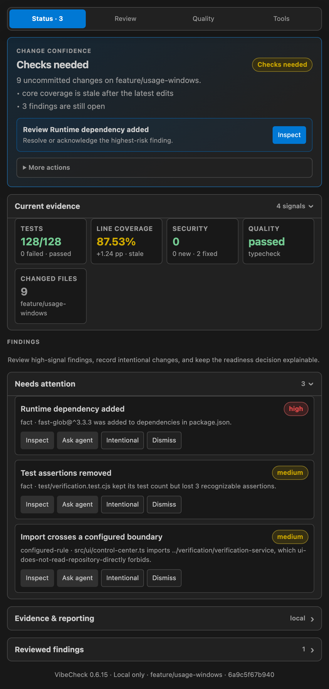
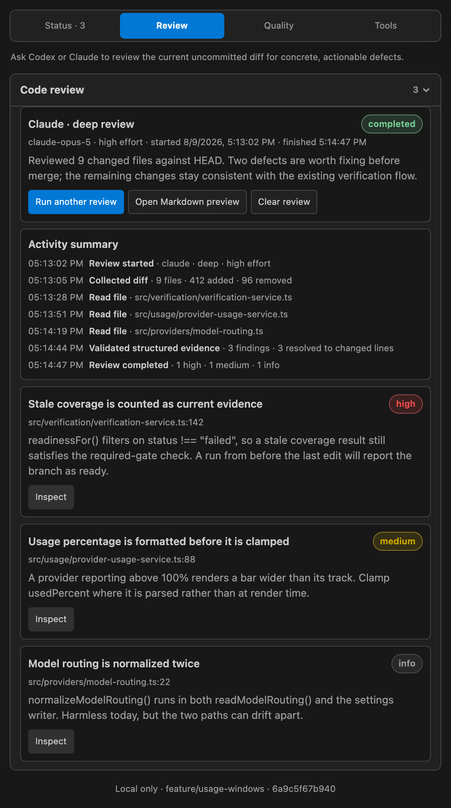
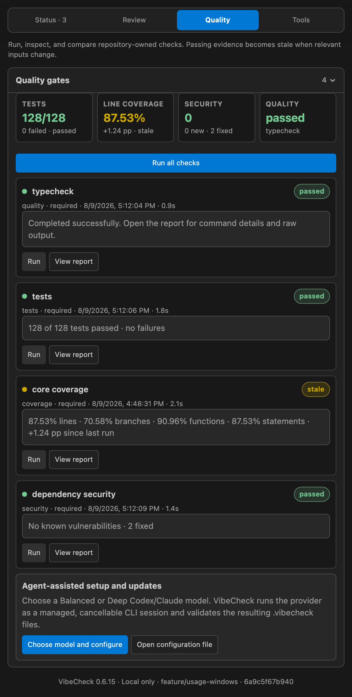
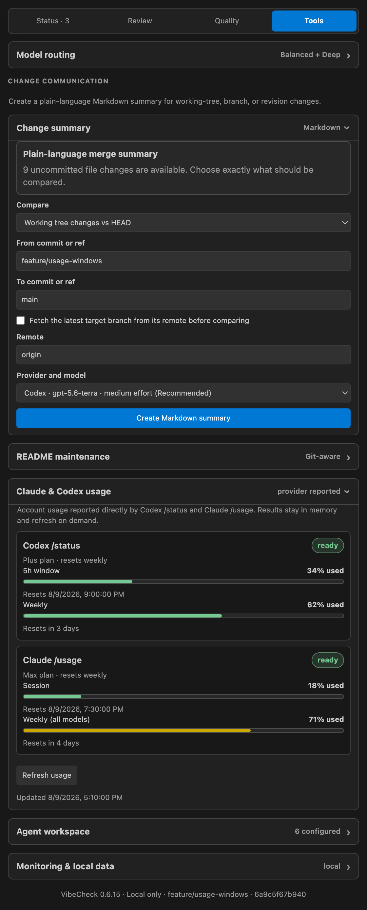

# VibeCheck

Local engineering confidence for AI-assisted coding.

VibeCheck is a VS Code extension that observes a Git-backed workspace, surfaces deterministic risks, tracks the freshness of user-configured verification, and provides evidence-oriented workflows for reviewing AI-assisted changes. It keeps the existing VS Code, Git, terminal, Codex, and Claude workflows in place rather than replacing them.

## See VibeCheck in action

The Control Center is a single Activity Bar panel with four tabs.

| Status | Review |
| --- | --- |
| [](docs/images/vibecheck-status.png) | [](docs/images/vibecheck-review.png) |
| One readiness verdict, the evidence behind it, and the findings still holding it back. | Explicit Codex or Claude semantic review, with every defect tied to a file and line. |

| Quality | Tools |
| --- | --- |
| [](docs/images/vibecheck-quality.png) | [](docs/images/vibecheck-tools.png) |
| Repository-owned gates keep their command, result, timing, and report — and go stale when inputs change. | Change summaries, README maintenance, provider usage, and local-data controls. |

Screenshots are generated from the real panel with `npm run screenshots`; see [docs/screenshots/](docs/screenshots/).

## What it provides

- A VibeCheck Activity Bar Control Center, status bar, and diagnostics for local repository state.
- Git- and workspace-based observation with start, pause, refresh, and local-data deletion controls.
- Deterministic findings for runtime dependency changes, deleted or skipped/focused tests, removed assertions, sensitive-file changes, generated or binary additions, broad diffs, and configured import-boundary violations.
- Explicit, trusted verification commands with pass/fail/stale state, input hashing, bounded output retention, and secret-assignment redaction.
- Repository Markdown plan discovery and active-plan selection.
- Markdown evidence reports, verification reports, and change summaries.
- Explicit Codex or Claude semantic code reviews that validate structured file and line evidence before it reaches workspace state.
- Optional local Codex and Claude hook adapters that ingest bounded lifecycle metadata.
- Reviewed generation, preview, application, alignment, and reset flows for Claude and Codex workspace instruction/supporting files.
- Optional Codex and Claude usage snapshots.

## Requirements

- Node.js 22 or later
- npm
- VS Code compatible with extension engine `^1.100.0`
- Git

Codex and Claude CLIs are optional. They are used only for the corresponding explicitly selected provider workflows, such as semantic review, change summaries, README maintenance, instruction proposals, and usage refresh.

## Install and verify

```bash
npm install
npm run verify
```

`npm run verify` type-checks the extension, bundles its runtime, and runs the covered test suite.

## Run in VS Code

1. Open this repository root in VS Code.
2. Select **Run VibeCheck Extension** in **Run and Debug**.
3. Press `F5`.
4. In the Extension Development Host, open a Git-backed project with at least one commit.
5. Open the VibeCheck Activity Bar view.

The launch configuration starts the `watch` task. Runtime messages are available in the **VibeCheck** Output channel.

## Common workflows

### Observe a workspace

VibeCheck activates after VS Code startup. In a workspace folder, use the VibeCheck commands or Control Center to start or pause observation and refresh the current workspace state. The `vibecheck.autoStart` setting is enabled by default for Git workspaces.

Use native VS Code Source Control and diff views to inspect changes. VibeCheck reports evidence and does not stage, commit, or replace VS Code’s source-control experience.

### Review findings

Findings include a severity, provenance, status, and local evidence. They can be inspected, accepted as intentional, dismissed, or reopened. The deterministic analyzer currently recognizes:

- Runtime dependency additions or version changes in `package.json`.
- Deleted tests, newly focused/skipped tests, and reduced recognizable assertions.
- Changes to authentication, migrations/schema, infrastructure, container, environment, and GitHub workflow files.
- Added generated or binary files.
- Diffs exceeding the configured file-count threshold.
- Relative TypeScript or JavaScript imports that violate configured architecture boundaries.

### Run verification

Use **Run Verification** for an individual configured gate or **Run All Verification** for every configured gate. VibeCheck runs only commands listed in `.vibecheck/config.yaml`; command execution is an explicit trust boundary. If a configured command changes, trust must be renewed.

Verification results are associated with relevant workspace inputs. Changing a matching file makes a prior result stale rather than treating an earlier successful run as current.

### Run a semantic code review

Use **Run Code Review** and choose a configured provider/profile. Semantic reviews are explicit and read-only. VibeCheck validates structured evidence before persisting findings, keeps provider activity bounded, and marks reviews stale after relevant edits.

Because the selected provider may process repository content through its configured service, use this workflow only when that processing is appropriate for the repository.

### Generate developer-facing artifacts

The Control Center can create local Markdown change summaries and evidence reports. It can also request a provider-generated README or reviewed Claude/Codex workspace-file proposal. Generated instruction/supporting-file changes are previewed and applied only through an explicit action; stale proposals and embedded JSON credentials are rejected.

## Configuration

Repository configuration lives in `.vibecheck/`:

- [`config.yaml`](.vibecheck/config.yaml) defines plan discovery, verification commands, invalidation paths, and the diff-expansion threshold.
- [`rules.yaml`](.vibecheck/rules.yaml) defines import boundaries.

The current configuration defines these required quality gates:

| Gate | Command |
| --- | --- |
| Typecheck | `npm run check` |
| Tests | `npm run test` |
| Core coverage | `npm run coverage` |
| Dependency security | `npm run security` |

A verification definition contains a name, command, invalidation patterns, optional category, and required flag. For example:

```yaml
verification:
  - name: typecheck
    category: quality
    required: true
    command: npm run check
    invalidated_by:
      - src/**
      - tsconfig.json
```

### Metrics parsing

VibeCheck reads pass/fail counts, coverage percentages, and vulnerability counts out of each gate's output. Detection is automatic: it tries every parser for the gate's category and keeps the first confident match.

| Category | Supported formats |
| --- | --- |
| `tests` | `junit`, `tap`, `jest`, `vitest`, `mocha` |
| `coverage` | `lcov`, `cobertura`, `istanbul-json`, `istanbul-text`, `go-coverage`, `coverage-total` |
| `security` | `npm-audit-json`, `sarif`, `npm-audit-text` |

Interchange formats are the portable path — any runner that can emit JUnit XML, LCOV, Cobertura, or SARIF is supported without a VibeCheck change.

Two optional fields override detection:

```yaml
verification:
  - name: tests
    category: tests
    required: true
    command: npx vitest run --reporter=junit --outputFile=reports/junit.xml
    format: junit                 # pin the parser; "auto" (default) or "none" to disable
    report_path: reports/junit.xml # parse this artifact instead of the command's output
    invalidated_by:
      - src/**
```

`report_path` is the more reliable option where a runner can already write a report, because terminal output carries colour codes, progress redraws, and interleaved stderr. The path must be repository-relative, and the artifact is read whether the command passed or failed. If it is missing, VibeCheck falls back to parsing the command output and says so.

When no parser recognizes a gate's output, the gate reports that explicitly rather than showing an empty metric, so a missing format is distinguishable from a check that never ran.

The extension also contributes these VS Code settings:

| Setting | Default | Purpose |
| --- | --- | --- |
| `vibecheck.autoStart` | `true` | Start local observation automatically in Git workspaces. |
| `vibecheck.refreshDebounceMs` | `750` | Delay before refreshing state after workspace changes. |
| `vibecheck.alignAgentWorkspace` | `false` | Continuously align safe portable Claude/Codex workspace files. |
| `vibecheck.codexBalancedModel` | `gpt-5.6-terra` | Codex model for Balanced provider workflows. |
| `vibecheck.codexDeepModel` | `gpt-5.6-sol` | Codex model for Deep provider workflows. |
| `vibecheck.claudeBalancedModel` | `claude-sonnet-5` | Claude model for Balanced provider workflows. |
| `vibecheck.claudeDeepModel` | `claude-opus-5` | Claude model for Deep provider workflows. |

## Development commands

```bash
npm run check
npm run test
npm run coverage
npm run security
npm run verify
npm run watch
npm run package:vsix
```

`test` compiles the extension before running the Node test suite. `coverage` enforces configured line, function, branch, and statement thresholds. `security` runs `npm audit` at the high severity threshold. `package:vsix` runs verification and writes a versioned extension package under `packages/`.

Install a locally packaged build with:

```bash
code --install-extension packages/vibecheck-0.6.10.vsix --force
```

Reload the target VS Code window after installation.

For more development and manual-evaluation guidance, see [DEVELOPMENT.md](DEVELOPMENT.md).

## Architecture

```text
collectors ─┐
config ─────┼─> observation controller ─> persisted workspace state
analyzers ──┤              │                         │
verification┘              ├─> control center / status / diagnostics
plan documents ────────────┤
                           ├─> prompt and report builders
local agent events ────────┘
```

- `src/domain/` contains persisted and analysis-facing types and remains independent of adapters, analyzers, collectors, configuration, UI, and verification.
- `src/collectors/` reads workspace, Git, plan, and documented agent-file facts.
- `src/analyzers/` contains deterministic risk analysis.
- `src/verification/` executes trusted commands and tracks freshness.
- `src/reviews/` runs provider-backed reviews and validates their structured output.
- `src/adapters/` installs and reads optional local agent hooks.
- `src/agent-instructions/` manages reviewed workspace-file proposals, alignment, backups, and explicit apply boundaries.
- `src/ui/` renders the VS Code surfaces without directly importing collector, configuration, or verification modules.

The configured rules preserve two important boundaries: UI modules do not read repository/configuration/verification adapters directly, and domain modules do not depend on implementation layers.

## Local-first and privacy constraints

VibeCheck has no hosted backend, account requirement, telemetry pipeline, or required network connection. Repository findings, verification output, and reports remain local.

Provider-backed actions are opt-in and read-only. Provider prompts, assistant messages, transcripts, tool arguments, tool output, and credentials are not retained in persistent extension state. Review activity and provider usage information are bounded; usage monitoring retains normalized utilization/reset fields in memory rather than raw provider output or credentials.

Optional hook adapters are independently installable and retain only bounded normalized lifecycle metadata. VibeCheck can delete its local observation data and local adapter event files through the extension command.

## Project status

The repository’s implementation plan identifies the local repository-mode workflow, deterministic findings, verification freshness, plan-aware intervention, optional adapters, architecture-boundary checks, code review, and model routing as implemented. Current work is focused on product validation and hardening, including dogfooding, extension-host automation, large-repository performance measurement, richer language resolution, multi-root support, and adapter compatibility testing. See [PLAN.md](PLAN.md) for the detailed implementation plan.

<!-- vibecheck-readme: reviewed-at=2026-08-09T21:56:34.671Z; commit=fbbdfff4780a7e35a58f0216dd9d0476dd4fa38a -->
